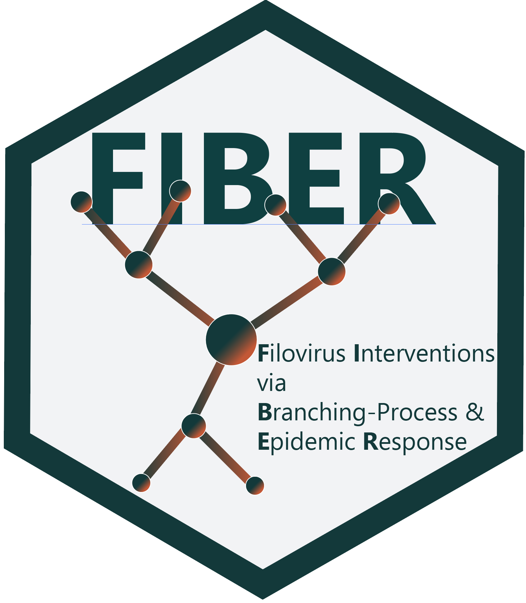

# fiber 

<!-- badges: start -->

[](https://www.repostatus.org/#wip)
<!-- badges: end -->

`fiber` is a branching-process model for simulating filovirus outbreaks and the impact of antivirals and other MCMs on outbreak control. It provides a modelling framewotk to design, simulate, and compare strategies for control of filoviral outbreaks, such as ebola and marburg.

## Installation

You can install the development version of `fiber` from GitHub using:

``` r
devtools::install_github("petal-code/fiber")
```
